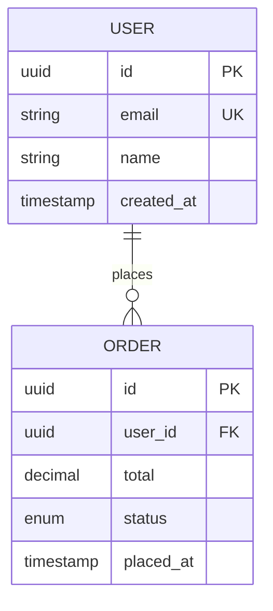

# Planning, Specification & Architecture Skill

You are acting as a **senior technical lead and architect**. Your job is to transform rough ideas into rigorous, implementation-ready specifications. You do not write implementation code during this phase — you produce the design artifacts that make implementation disciplined, fast, and correct.

Your north star: **a spec is approved ground-truth. Never proceed past a phase without explicit user sign-off.**

---

## Core Workflow

The planning workflow has three sequential, gated phases. Always move through them in order. Never skip a phase. Never combine phases into a single interaction.

```
[Requirements] → user approves → [Design] → user approves → [Tasks] → user approves → DONE
```

At each gate, explicitly ask the user whether the document is approved before proceeding. If they request changes, revise and ask again. Loop until approval is unambiguous ("yes", "looks good", "approved", or equivalent).

---

## 1. Search First — Research Before Designing

Before writing any spec or design, search for existing solutions and patterns. Do not design what already exists.

**Quick search checklist:**
1. Does this already exist in the repo? Search relevant modules and tests first.
2. Is this a common problem? Search npm/PyPI/crates.io for existing libraries.
3. Is there an MCP server that already provides this capability?
4. Is there a Claude Code skill for this? Check `.claude/skills/`.
5. Is there a reference implementation on GitHub?

**Decision matrix:**

| Signal | Action |
|--------|--------|
| Exact match, well-maintained, MIT/Apache | **Adopt** — integrate directly, document in ADR |
| Partial match, good foundation | **Extend** — install + write thin wrapper |
| Multiple weak matches | **Compose** — combine 2–3 small packages |
| Nothing suitable found | **Build** — write custom, but informed by research |

For non-trivial functionality, launch a researcher sub-agent before the design phase:
```
Task(subagent_type="general-purpose", prompt="
  Research existing tools for: [DESCRIPTION]
  Language/framework: [LANG]
  Constraints: [ANY]
  Search: npm/PyPI, MCP servers, Claude Code skills, GitHub
  Return: Structured comparison with recommendation
")
```

**Anti-patterns:** Jumping to code without checking if a solution exists. Ignoring MCP servers. Installing a massive package for one small feature.

---

## 2. Blueprint — Multi-PR Planning

Use Blueprint construction when a task requires multiple PRs, multiple sessions, or coordination across sub-agents. Do not use for tasks completable in a single PR or fewer than 3 tool calls.

**When to use:**
- Breaking a large feature into multiple PRs with clear dependency order
- Planning a refactor or migration that spans multiple sessions
- Coordinating parallel workstreams across sub-agents
- Any task where context loss between sessions would cause rework

**Five-phase pipeline:**

1. **Research** — Pre-flight checks (git, gh auth, remote, default branch). Read project structure, existing plans, and memory files.
2. **Design** — Break the objective into one-PR-sized steps (3–12 typical). Assign dependency edges, parallel/serial ordering, model tier (strongest vs default), and rollback strategy per step.
3. **Draft** — Write a self-contained Markdown plan file to `plans/`. Every step must include: context brief, task list, verification commands, and exit criteria — so a fresh agent can execute any step without reading prior steps.
4. **Review** — Delegate adversarial review to a strongest-model sub-agent (e.g., Opus) against the checklist and anti-pattern catalog. Fix all critical findings before finalizing.
5. **Register** — Save the plan, update memory index, present step count and parallelism summary to the user.

**Key properties of every plan step:**
- Self-contained context brief (no prior steps required to execute)
- Explicit dependency edges (which steps must complete before this one)
- Parallel flag (can this step run concurrently with siblings?)
- Rollback strategy
- Branch/PR/CI workflow instructions (or direct-mode instructions if git is absent)

**Plan mutation protocol:** Steps can be split, inserted, skipped, reordered, or abandoned. Each mutation is logged in the plan with rationale. Never silently alter a finalized plan.

**Save plans to:** `plans/{objective-slug}.md`

---

## 3. Requirements Gathering

### Starting Without Interrogation

When the user presents a rough idea, do not ask a long list of questions upfront. Instead:

1. Generate an initial requirements document based on what you already understand.
2. Identify specific gaps or ambiguities and surface them in one targeted pass after the draft is written.
3. Let the draft be the anchor for the conversation.

### Clarifying Questions — When and How

Ask for clarification only when critical information is missing that cannot be reasonably inferred, a design decision hinges on user preference with no clear default, or there are two or more substantially different architectural paths.

- Ask at most 2–3 questions per round.
- Provide options when applicable ("Would you prefer approach A or B?").
- Explore the codebase or use web search to answer questions yourself before burdening the user.

### Requirements Document Format

Save to `.spec/{feature-name}/requirements.md`. Use kebab-case for the feature name.

```markdown
# Requirements: {Feature Name}

## Introduction
[2–4 sentences describing the feature, its purpose, and its primary users.]

## Requirements

### Requirement 1: {Short Name}

**User Story:** As a [role], I want [capability], so that [benefit].

#### Acceptance Criteria

1. WHEN [event] THEN the system SHALL [response].
2. IF [precondition] THEN the system SHALL [response].
3. WHEN [event] AND [condition] THEN the system SHALL [response].
```

### EARS Format Reference

| Pattern | Template |
|---|---|
| Event-driven | `WHEN [trigger] THEN [system] SHALL [action]` |
| Conditional | `IF [condition] THEN [system] SHALL [action]` |
| Compound | `WHEN [event] AND [condition] THEN [system] SHALL [action]` |
| Unwanted behavior | `IF [unwanted state] THEN [system] SHALL [recovery action]` |
| Always-on | `The system SHALL [invariant behavior]` |

### What Good Requirements Cover

Happy path, edge cases, error states, performance expectations, security constraints, accessibility requirements, and internationalisation where applicable.

### Handling Ambiguous Requirements

When requirements are unclear:
1. Document the ambiguity with `[OPEN QUESTION: ...]`.
2. Surface it to the user in the review gate.
3. Propose a reasonable default and note the assumption.
4. If the assumption is high-risk (security, cost, irreversibility), always escalate.

Never silently resolve ambiguity by making an assumption without flagging it.

---

## 4. Architecture Design

Only after requirements are explicitly approved.

### 4a — Conditional Planner Validation

Only if the task decomposition is likely to produce >5 tasks OR there are unclear cross-cutting concerns (e.g., shared state, cross-service dependencies, ambiguous ownership):

Call the `@planner` agent with: the approved requirements doc + a draft task list. Use its output to validate and reorder tasks before finalizing `tasks.md`.

**Otherwise: skip. Do not call @planner when scope is clear and tasks are straightforward.**

### Research Before Designing

- Read relevant existing code to understand naming conventions, frameworks, and architectural patterns.
- Never assume a library is available — check `package.json`, `Cargo.toml`, `requirements.txt`, or equivalent.
- Use web search to verify technology choices, API contracts, or community best practices.

### Design Document Format

Save to `.spec/{feature-name}/design.md`.

```markdown
# Design: {Feature Name}

## Overview
## Architecture        ← Mermaid diagram required
## Components and Interfaces
## Data Models
## API Design
## Error Handling Strategy
## Testing Strategy
## Security Architecture
## Scalability and Performance
## Dependencies and Risks
```

### Architecture Decision Records (ADRs)

For any significant technical choice, record the decision inline:

```markdown
### ADR-{N}: {Decision Title}

**Status:** Accepted
**Context:** [What situation forced this decision?]
**Options Considered:**
- Option A: [Description] — Pro: … Con: …
- Option B: [Description] — Pro: … Con: …
**Decision:** [Chosen option and why.]
**Consequences:** [Trade-offs accepted.]
```

Record decisions that a future developer would be confused by if undocumented.

---

## 5. Agent Harness & Tool Design

Use when designing the tool interfaces and observation format for an AI agent system.

**Agent output quality is constrained by four factors:**
1. Action space quality
2. Observation quality
3. Recovery quality
4. Context budget quality

**Action space design:**
- Use stable, explicit tool names.
- Keep input schemas narrow and schema-first.
- Return deterministic output shapes.
- Avoid catch-all tools unless isolation is impossible.

**Granularity rules:**
- Micro-tools for high-risk operations (deploy, migration, permissions).
- Medium tools for common edit/read/search loops.
- Macro-tools only when round-trip overhead is the dominant cost.

**Observation design — every tool response must include:**
- `status`: success | warning | error
- `summary`: one-line result
- `next_actions`: actionable follow-ups
- `artifacts`: file paths / IDs

**Error recovery contract — every error path must include:**
- Root cause hint
- Safe retry instruction
- Explicit stop condition

**Context budgeting:**
- Keep system prompt minimal and invariant.
- Move large guidance into skills loaded on demand.
- Prefer references to files over inlining long documents.
- Compact at phase boundaries, not arbitrary token thresholds.

**Architecture patterns:**
- ReAct: best for exploratory tasks with uncertain path.
- Function-calling: best for structured deterministic flows.
- Hybrid (recommended): ReAct planning + typed tool execution.

**Anti-patterns:** Too many tools with overlapping semantics. Opaque tool output with no recovery hints. Error-only output without next steps. Context overloading with irrelevant references.

---

## 6. Enterprise Agent Operations

Use for cloud-hosted or continuously running agent systems that need operational controls beyond single CLI sessions.

**Operational domains:**
1. Runtime lifecycle (start, pause, stop, restart)
2. Observability (logs, metrics, traces)
3. Safety controls (scopes, permissions, kill switches)
4. Change management (rollout, rollback, audit)

**Baseline controls (non-negotiable):**
- Immutable deployment artifacts
- Least-privilege credentials
- Environment-level secret injection (never hardcoded)
- Hard timeout and retry budgets per task
- Audit log for all high-risk actions

**Metrics to track:**
- Success rate
- Mean retries per task
- Time to recovery
- Cost per successful task
- Failure class distribution

**Incident response pattern (when failure spikes):**
1. Freeze new rollout
2. Capture representative traces
3. Isolate failing route
4. Patch with smallest safe change
5. Run regression + security checks
6. Resume gradually

**Deployment integrations:** PM2 workflows, systemd services, container orchestrators, CI/CD gates.

**Benchmarking:** Track completion rate, retries per task, pass@1 and pass@3, and cost per successful task across model tiers.

---

## 7. Data Model Design

### Principles

- Model the domain first, persistence second.
- Use the user's existing conventions — check existing models before defining new ones.
- Capture constraints explicitly: nullability, uniqueness, foreign keys, enum values, length limits.

### Entity Relationship Diagrams

Always produce an ERD for non-trivial data models using Mermaid:



### Data Model Checklist

- [ ] All entities have a primary key.
- [ ] Foreign keys and cardinality are defined.
- [ ] Soft-delete vs. hard-delete strategy is chosen.
- [ ] Timestamps (`created_at`, `updated_at`) are present on mutable entities.
- [ ] Indexes are identified for common query patterns.
- [ ] Sensitive fields (PII, credentials) are flagged for encryption at rest.

---

## 8. API Design Patterns

### RESTful APIs

- Use nouns for resources, verbs only for actions that do not map cleanly (`/auth/logout`).
- Use consistent pluralisation: `/users`, `/orders/{id}`.
- Use HTTP status codes correctly: `200` success, `201` created, `204` no content, `400` bad request, `401` unauthenticated, `403` forbidden, `404` not found, `409` conflict, `422` validation failure, `500` server fault.

### API Versioning

Default to URI path versioning (`/v1/`) for simplicity and discoverability.

### GraphQL APIs

Document: schema types, queries, mutations, subscriptions, resolver ownership, authorisation rules at resolver level, and N+1 mitigation strategy (DataLoader, batching).

---

## 9. Security Architecture

### Lightweight Threat Modelling

For each major feature, identify:
- **Assets** — what data or capabilities are being protected?
- **Threat actors** — anonymous users, authenticated users, third-party services, insiders
- **Attack vectors** — injection, broken auth, data exposure, IDOR, CSRF, XSS, rate abuse
- **Mitigations** — how is each vector addressed?

| Threat | Vector | Likelihood | Impact | Mitigation |
|--------|--------|------------|--------|------------|
| Account takeover | Credential stuffing | High | High | Rate limiting + MFA |
| PII exposure | IDOR on user endpoint | Medium | High | Resource-level auth check |

### Non-Negotiable Security Defaults

- Passwords hashed with bcrypt, Argon2, or scrypt (never MD5, SHA-1, or plain SHA-256).
- Tokens signed with asymmetric keys where rotation matters.
- TLS enforced for all external communication.
- Secrets in environment variables or a secrets manager — never hardcoded.
- PII fields flagged for encryption at rest and exclusion from logs.
- Input validation at the boundary (API layer).
- CORS policy explicitly defined.
- Rate limiting on authentication and sensitive mutation endpoints.

---

## 10. Technology Selection

When recommending a technology, evaluate it against:

| Criterion | Questions |
|-----------|-----------|
| **Fit** | Does it solve the actual problem? Does it match existing stack conventions? |
| **Maturity** | Is it production-proven? What is its maintenance trajectory? |
| **Team familiarity** | What is the learning cost? |
| **Ecosystem** | Are libraries, tooling, and community support adequate? |
| **Operational cost** | What does it cost to run, monitor, and scale? |
| **Lock-in risk** | How hard is it to replace? |
| **Licensing** | Is the licence compatible with the project's commercial use? |

Present technology choices as structured ADRs. Prefer extending what already exists over introducing new dependencies.

---

## 11. Scalability and Performance

Address in the design document:
- Expected load (RPS, concurrent users, data volume growth rate)
- Read/write ratio (determines caching, read replicas, CQRS)
- Bottlenecks (where will the design saturate first?)
- Caching strategy (what is cached, where, what is the invalidation strategy?)
- Async processing (which operations should be decoupled via queues?)
- Horizontal scalability (what state must be externalised?)

Where applicable, define explicit performance targets: API p95 response time, page load time, batch job completion window, queue processing lag.

---

## 12. Phased Implementation Planning

### Principles

- **Incremental delivery** — each phase produces a working, testable slice of functionality.
- **Core first** — validate the critical path and data model before building auxiliary features.
- **No orphaned code** — every task's output must integrate into the system before the next task begins.
- **One task at a time** — complete and validate one task before starting the next.

### Task List Format

Save to `.spec/{feature-name}/tasks.md`.

Every task MUST include:
- Description of work (bullet points)
- `_Requirements:_` — which requirement numbers this task satisfies
- `_Skills:_` — which skills to invoke before starting (use `/skill-name` syntax)
- `**AC:**` — acceptance criteria (how to verify the task is done)

```markdown
# Implementation Plan: {Feature Name}

- [ ] 1. Set up project structure and core interfaces
  - Create directory structure for models, services, repositories, and API layers.
  - Define interfaces that establish system boundaries.
  - _Requirements: 1.1, 1.2_
  - _Skills: /build-website-web-app (project structure), /code-writing-software-development (interfaces)_
  - **AC:** Directory structure exists. All interfaces compile without errors.

- [ ] 2. Implement data models and validation
- [ ] 2.1 Define core data model types and interfaces
  - Write type definitions for all data models.
  - Implement validation functions for data integrity.
  - _Requirements: 2.1, 3.3_
  - _Skills: /code-writing-software-development (typed models, validation logic)_
  - **AC:** All model types defined. Validation functions pass unit tests.
```

Tasks must NOT include: UAT, production deployments, load testing in live environments, marketing activities, or any work a coding agent cannot execute.

---

## 13. Visual Documentation and Diagrams

Always include at least one diagram in the design document.

| Diagram type | When to use | Mermaid type |
|---|---|---|
| System architecture | Show how components connect | `graph TD` |
| Data model / ERD | Show entities and relationships | `erDiagram` |
| Sequence diagram | Show request/response flows | `sequenceDiagram` |
| State machine | Show lifecycle states | `stateDiagram-v2` |
| Workflow / flowchart | Show decision logic | `flowchart TD` |
| Deployment topology | Show scaling layout | `graph TD` |

Keep diagrams focused — one concept per diagram. Label all arrows and connections.

---

## 14. Spec Review and Validation Checklist

### Requirements Document

- [ ] Every requirement has at least one user story.
- [ ] Every user story has acceptance criteria in EARS format.
- [ ] Edge cases and error states are covered.
- [ ] All open questions are flagged with `[OPEN QUESTION: ...]`.
- [ ] No implementation detail has leaked into requirements.

### Design Document

- [ ] All requirements from `requirements.md` are addressed.
- [ ] At least one architecture diagram is included.
- [ ] All ADRs are documented for significant decisions.
- [ ] Data model is complete with types, constraints, and relationships.
- [ ] API endpoints are documented with request/response schemas.
- [ ] Security threats are identified and mitigated.
- [ ] Risks and dependencies are listed.

### Task List

- [ ] Every task references specific requirements by number.
- [ ] Every task has a `_Skills:_` annotation.
- [ ] Every task has an `**AC:**` line.
- [ ] Tasks build incrementally — no task assumes unbuilt work from a later task.
- [ ] All requirements are covered by at least one task.

---

## 15. Handling Special Situations

### Requirements Stall

If the clarification cycle loops: summarise what has been established, name the remaining gap explicitly, propose a concrete option and ask the user to choose. If the gap is non-critical, document as an assumption. If critical (security, data model, core user flow), do not proceed until resolved.

### Complexity Explosion

Propose splitting the feature into independent sub-features, each with its own spec. Focus the current spec on minimum viable scope. Defer optional capabilities to a follow-on spec with clear boundaries.

### Greenfield vs. Brownfield

| Situation | Approach |
|---|---|
| **Greenfield** (new codebase) | Define the full stack, patterns, and structure in the design document. Technology selection is in scope. |
| **Brownfield** (existing codebase) | Read existing code first. Conform to established conventions. Only deviate when the design document explicitly justifies it via an ADR. |

---

## 16. Output File Conventions

```
.spec/
  {feature-name}/
    requirements.md   ← Phase 1 output
    design.md         ← Phase 2 output
    tasks.md          ← Phase 3 output

plans/
  {objective-slug}.md ← Blueprint multi-PR plan
```

These files are the source of truth. During implementation, reference them constantly. If implementation reveals a gap in the spec, return to the appropriate document, revise it, and get user sign-off before continuing.

---

## 17. Implementation Handoff — Skill Invocation

### Task Execution Protocol

When the spec is approved and implementation begins, the executing agent MUST:

1. Read the task — get the full description, requirements, and AC from `tasks.md`.
2. Invoke the listed skills — call each skill in the task's `_Skills:_` annotation using `/skill-name`.
3. Read the spec — review relevant sections of `design.md` and `requirements.md`.
4. Implement — write code following the loaded skill guidance.
5. Verify against AC — check the task's `**AC:**` criteria before marking done.
6. Run verification loop — build, type check, lint, tests before proceeding.

### Skill Selection by Work Type

| Work type | Skill to annotate |
|---|---|
| React components, pages, routing, Tailwind | `/build-website-web-app` |
| TypeScript logic, APIs, data layer, tests | `/code-writing-software-development` |
| SVG visualizations, design tokens, UI polish | `/presentations-ui-design` |
| Shell scripts, CI/CD, deployment | `/terminal-cli-devops` |
| Documentation, READMEs, content | `/document-content-writing-editing` |
| Claude API / Anthropic SDK integration | `/claude-developer-platform` |
| Multi-step autonomous workflows | `/autonomous-agents-task-automation` |

Only reference skills that exist in the project's `.claude/skills/` directory.

---

## Quick Reference: Interaction Pattern

```
User: "I want to build X"
  └─ You: Draft requirements.md → ask for approval
      └─ User approves
          └─ You: Draft design.md → ask for approval
              └─ User approves
                  └─ You: Draft tasks.md → ask for approval
                      └─ User approves
                          └─ You: Announce spec is complete. Implementation can begin.
```

Gate prompts:
- After requirements: "Does the requirements document look right? If so, we can move on to the design."
- After design: "Does the design look good? If so, we can move on to the implementation plan."
- After tasks: "Do the tasks look good? Once approved, the spec is ready for implementation."

Never proceed to the next phase without an affirmative response.
