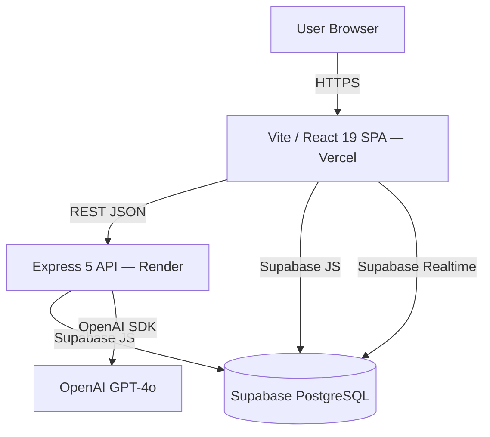

# Design: Proof-Reading Engine — Feature Roadmap

## Overview

AI-powered document proofreading web app. Users upload DOCX/PDF/TXT, receive section-by-section AI review (grammar, clarity, humanization), and export corrected versions. This document covers the 10-feature product roadmap layered on the existing monorepo.

**Existing stack:** React 19 + Vite + TypeScript (frontend) / Express 5 + TypeScript + OpenAI SDK + Supabase (backend). Monorepo: `frontend/` + `backend/`.

---

## Architecture



---

## Existing Schema (post-migration 004)

```
sessions: id · user_id · filename · file_type · status · document_type · created_at · updated_at
sections: id · session_id · position · section_type · heading_level · original_text · corrected_text
          reference_text · final_text · change_summary · status · ai_score · humanized_text
          created_at · updated_at
```

---

## Feature Roadmap — 10 New Features

Priority order: Quick wins → Best product loop → Retention → Complex

| # | Feature | Task | Priority |
|---|---------|------|----------|
| 8 | Readability Score per Section | task-003 | Quick win — client-side, no GPT |
| 1 | Independent AI Reviewer | task-004 | Quick win |
| 5 | Tone & Audience Consistency Check | task-005 | Quick win |
| 6 | Document Completeness Score | task-006 | Product loop |
| 3 | Structured Section Insertion (AI-Guided) | task-007 | Product loop |
| 4 | Reformat Existing Section | task-008 | Product loop |
| 10 | Export with Track Changes | task-009 | Retention |
| 7 | Version Diffing & Quality Delta | task-010 | Retention |
| 2 | Document Q&A Chat | task-011 | Complex |
| 9 | Citation & Claim Detector | task-012 | Complex |

---

## API Design

All endpoints require `Authorization: Bearer <jwt>` header (existing pattern from sessions.ts).

### New endpoints (tasks 003–012)

```
GET  /api/sessions/:id/review          → ReviewReport (task-004)
GET  /api/sessions/:id/tone            → ToneReport (task-005)
GET  /api/sessions/:id/completeness    → CompletenessReport (task-006)
POST /api/sessions/:id/sections/insert → SectionRecord (task-007)
POST /api/sections/:id/reformat        → SectionRecord (task-008)
GET  /api/sessions/:id/export/docx-tracked → blob .docx (task-009)
GET  /api/sessions/:id/diff/:compareId → DiffReport (task-010)
POST /api/sessions/:id/chat            → ChatMessage (task-011)
GET  /api/sessions/:id/citations       → CitationReport (task-012)
```

---

## Database Architecture

### New migrations required

**005_review_score.sql** (task-004)
```sql
ALTER TABLE sessions ADD COLUMN IF NOT EXISTS review_score integer;
ALTER TABLE sessions ADD COLUMN IF NOT EXISTS review_report jsonb;
```

**006_tone_check.sql** (task-005)
```sql
ALTER TABLE sections ADD COLUMN IF NOT EXISTS tone_label text;
ALTER TABLE sections ADD COLUMN IF NOT EXISTS tone_score integer;
ALTER TABLE sessions ADD COLUMN IF NOT EXISTS tone_consistency_score integer;
```

**007_completeness.sql** (task-006)
```sql
ALTER TABLE sessions ADD COLUMN IF NOT EXISTS completeness_score integer;
ALTER TABLE sessions ADD COLUMN IF NOT EXISTS completeness_report jsonb;
```

**008_chat_history.sql** (task-011)
```sql
CREATE TABLE IF NOT EXISTS public.chat_messages (
  id uuid PRIMARY KEY DEFAULT gen_random_uuid(),
  session_id uuid NOT NULL REFERENCES public.sessions(id) ON DELETE CASCADE,
  role text NOT NULL CHECK (role IN ('user', 'assistant')),
  content text NOT NULL,
  created_at timestamptz NOT NULL DEFAULT now()
);
ALTER TABLE public.chat_messages ENABLE ROW LEVEL SECURITY;
-- RLS: same pattern as sections (join to sessions where user_id = auth.uid())
```

---

## Existing Key Types (from ReviewPage.tsx)

```typescript
// frontend/src/ReviewPage.tsx
interface SectionRecord {
  id: string;
  session_id: string;
  position: number;
  section_type: string;
  heading_level: number | null;
  original_text: string;
  corrected_text: string | null;
  reference_text: string | null;
  final_text: string | null;
  change_summary: string | null;
  ai_score: number | null;
  humanized_text: string | null;
  status: 'pending' | 'ready' | 'accepted' | 'rejected';
  created_at: string;
  updated_at: string;
}

interface SessionRecord {
  id: string;
  filename: string;
  file_type: string;
  status: string;
  created_at: string;
  updated_at: string;
}
```

---

## Security Architecture

- All API endpoints: JWT verification via existing `requireAuth` middleware (`backend/src/middleware/auth.ts`)
- Resource ownership: `sessions.user_id = auth.uid()` check on every route handler
- OpenAI calls: server-side only — API key never sent to frontend
- Export blobs: set `Content-Disposition: attachment` to prevent inline execution
- Chat messages: RLS policy mirrors sections pattern — join through sessions
- Input validation: text length caps (8000 chars per section for GPT calls)

---

## Testing Strategy

- Unit tests: vitest (backend), vitest (frontend via vite)
- E2E: Playwright (`e2e/` directory, `playwright.config.ts` at root)
- Per-task: each task-NNN.md contains its own test file template
- Pattern: mock `../services/openai` in backend unit tests using `vi.mock`
- Pattern: Playwright tests use `page.goto('/review/:id')` after seeding via API

---

## Scalability & Performance

- Readability score (task-003): computed client-side — zero server load
- AI reviewer (task-004): single GPT-4o call per session on demand — cached in `sessions.review_report`
- Tone check (task-005): per-section labels computed during proofreading pass — no extra GPT round-trip if piggybacked
- Chat (task-011): streaming via `openai.chat.completions.create({ stream: true })` → `res.write()` SSE
- Version diff (task-010): stored comparisons — diff computed server-side on demand, not stored

---

## Dependencies & Risks

| Risk | Mitigation |
|------|-----------|
| GPT-4o cost on new features | Cache results in DB; serve from cache on subsequent loads |
| docx track-changes format complexity | Use `docx` npm package which supports revision markup |
| Streaming chat on Render free tier | Render supports streaming; set `res.flushHeaders()` early |
| Flesch-Kincaid formula accuracy | Use established JS implementation (no dependency — inline formula) |
