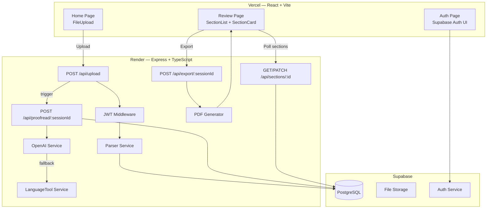

# Design — Proof-Reading Engine

## Architecture Overview



## Data Models

### sessions
```sql
CREATE TABLE sessions (
  id          UUID PRIMARY KEY DEFAULT gen_random_uuid(),
  user_id     UUID NOT NULL REFERENCES auth.users(id),
  filename    TEXT NOT NULL,
  file_type   TEXT NOT NULL CHECK (file_type IN ('docx','pdf','txt')),
  status      TEXT NOT NULL DEFAULT 'parsing'
              CHECK (status IN ('parsing','proofreading','review','done')),
  created_at  TIMESTAMPTZ DEFAULT NOW(),
  updated_at  TIMESTAMPTZ DEFAULT NOW()
);
```

### sections
```sql
CREATE TABLE sections (
  id              UUID PRIMARY KEY DEFAULT gen_random_uuid(),
  session_id      UUID NOT NULL REFERENCES sessions(id) ON DELETE CASCADE,
  position        INTEGER NOT NULL,
  section_type    TEXT NOT NULL CHECK (section_type IN ('heading','paragraph')),
  heading_level   INTEGER,
  original_text   TEXT NOT NULL,
  corrected_text  TEXT,
  reference_text  TEXT,
  final_text      TEXT,
  change_summary  TEXT,
  status          TEXT NOT NULL DEFAULT 'pending'
                  CHECK (status IN ('pending','ready','accepted','rejected')),
  created_at      TIMESTAMPTZ DEFAULT NOW(),
  updated_at      TIMESTAMPTZ DEFAULT NOW()
);
CREATE INDEX sections_session_position ON sections(session_id, position);
```

### Row-Level Security
```sql
ALTER TABLE sessions ENABLE ROW LEVEL SECURITY;
CREATE POLICY sessions_owner ON sessions USING (user_id = auth.uid());

ALTER TABLE sections ENABLE ROW LEVEL SECURITY;
CREATE POLICY sections_owner ON sections USING (
  session_id IN (SELECT id FROM sessions WHERE user_id = auth.uid())
);
```

## API Design

| Method | Route | Auth | Description |
|---|---|---|---|
| POST | /api/upload | JWT | Upload file(s), create session, trigger parse+proofread |
| GET | /api/sessions | JWT | List user's sessions |
| GET | /api/sessions/:id | JWT | Get session + sections |
| GET | /api/sections/:id | JWT | Get single section |
| PATCH | /api/sections/:id | JWT | Update final_text, status |
| POST | /api/export/:sessionId | JWT | Generate and stream PDF |

### POST /api/upload — Request
```
Content-Type: multipart/form-data
Fields:
  file        (required) — the document to proofread
  reference   (optional) — reference document
```

### POST /api/upload — Response
```json
{ "sessionId": "uuid", "sectionCount": 12, "status": "proofreading" }
```

### PATCH /api/sections/:id — Request
```json
{ "final_text": "...", "status": "accepted" }
```

### POST /api/export/:sessionId — Response
```
Content-Type: application/pdf
Content-Disposition: attachment; filename="proofread-YYYY-MM-DD.pdf"
[binary PDF stream]
```

## Proofreading Service Design

```typescript
const SYSTEM_PROMPT = `
You are a professional proofreader. Fix grammar, spelling, punctuation, style, and clarity.
Preserve the original meaning, tone, and structure.
Return JSON: { corrected_text: string, change_summary: string }
`;
// If reference present: append "Align style and terminology with this reference:\n<reference_text>"
```

Fallback: if OpenAI fails (rate limit, timeout, error), retry once, then call LanguageTool `/check` for grammar-only corrections.

## PDF Generation Design

Sections compiled in `position` order:
- `heading`: bold, font size by level (H1=20pt, H2=16pt, H3=13pt)
- `paragraph`: 11pt, 1.15 line height, paragraph spacing
- Rejected sections use `original_text`; accepted/edited use `final_text`

## Architecture Decision Records

### ADR-01: Node.js over FastAPI
Unified TypeScript monorepo, shared types, faster iteration. FastAPI preferred if heavy ML processing added later.

### ADR-02: pdf-lib over Puppeteer
No headless browser — reduces Render memory and cold-start time. Trade-off: programmatic layout instead of CSS.

### ADR-03: Supabase over custom auth
Auth + RLS eliminates custom JWT issuance and row-level access code. Trade-off: vendor lock-in, acceptable for this scope.

### ADR-04: Polling over WebSockets
Simpler infrastructure; 2s polling sufficient for proofreading latency. WebSockets can be added later for streaming corrections.

## Security Design

- All `/api/*` routes protected by `verifyJWT` middleware (Supabase JWT validation)
- File uploads validated by MIME type + extension before processing
- File size hard-limited to 20 MB via multer
- Uploaded files stored temporarily in `/uploads/`, deleted after parsing
- No raw SQL: all DB access via parameterized Supabase client queries
- OpenAI API key only on backend; never exposed to frontend
- CORS restricted to `FRONTEND_URL` env var

## Performance Design

- Parse + proofread triggered async after upload; frontend polls for readiness
- GPT-4o calls parallelized: up to 5 concurrent section corrections (rate-limit safe)
- Supabase indexes on `(session_id, position)` for fast section retrieval
- PDF generation streamed directly to response (no temp file on disk)
