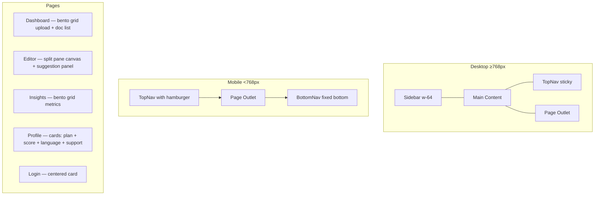
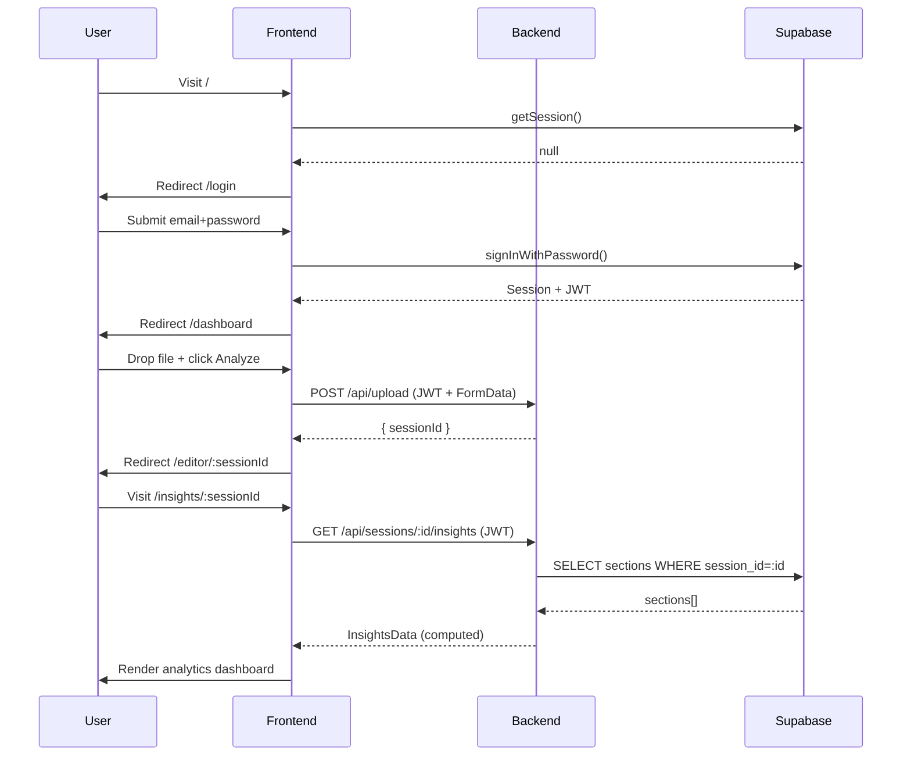

# Design: Editorial Intelligence UI

## Overview

The Editorial Intelligence UI transforms the current minimal frontend into a full multi-page editorial platform matching the Syntactic Prism design system. The implementation is a **brownfield extension** — the existing backend routes, `ReviewPage.tsx`, `SectionCard.tsx`, and Supabase auth remain unchanged. New pages and components are added around them, and three new backend endpoints are appended to the existing Express server.

React Router v6 is added as the only new frontend dependency. All routing is client-side. The backend stays on Express 5 with three new route files.

---

## Architecture

```mermaid
graph TD
    subgraph Frontend [Frontend — React 19 + Vite]
        A[main.tsx] --> B[App.tsx — BrowserRouter + AuthContext]
        B --> C{Authenticated?}
        C -- No --> D[LoginPage]
        C -- Yes --> E[AppShell — Sidebar + TopNav + BottomNav]
        E --> F[DashboardPage]
        E --> G[EditorPage]
        E --> H[InsightsPage]
        E --> I[ProfilePage]
        G --> J[ReviewPage — existing logic]
        G --> K[SuggestionPanel — new]
    end

    subgraph Backend [Backend — Express 5]
        L[server.ts]
        L --> M[/api/upload — existing]
        L --> N[/api/sessions/:id — existing]
        L --> O[/api/sections — existing]
        L --> P[/api/export — existing]
        L --> Q[/api/sessions — NEW sessions-list.ts]
        L --> R[/api/sessions/:id/insights — NEW insights.ts]
        L --> S[/api/users/me — NEW profile.ts]
    end

    Frontend -- HTTP + JWT --> Backend
    Backend -- Supabase SDK --> T[(Supabase DB)]
```

---

## Components and Interfaces

### New File Structure

```
frontend/src/
  context/
    AuthContext.tsx          ← Supabase session + user, shared globally
  pages/
    LoginPage.tsx
    DashboardPage.tsx
    EditorPage.tsx           ← wraps ReviewPage + SuggestionPanel
    InsightsPage.tsx
    ProfilePage.tsx
  components/
    layout/
      AppShell.tsx           ← Outlet wrapper: Sidebar + TopNav + BottomNav
      Sidebar.tsx
      TopNav.tsx
      BottomNav.tsx
    SuggestionPanel.tsx
    DocumentCard.tsx
    MetricCard.tsx
    ProgressBar.tsx          ← labeled % bar
    CircularProgress.tsx     ← SVG donut

backend/src/routes/
  sessions-list.ts
  insights.ts
  profile.ts
```

### AuthContext

```typescript
interface AuthContextValue {
  session: Session | null;
  user: User | null;
  loading: boolean;
  signOut: () => Promise<void>;
}
```

- Wraps `supabase.auth.getSession()` + `onAuthStateChange` (logic moved from current `App.tsx`).
- Provided at the root in `App.tsx` so all pages can consume it without prop drilling.
- `loading: true` until the initial `getSession()` resolves — prevents flash-of-unauthenticated-content.

### AppShell

```typescript
// Props: none — reads from AuthContext and React Router Outlet
function AppShell(): JSX.Element
```

- Desktop layout: `flex h-screen` — `<Sidebar />` (w-64, fixed) + `<main>` (flex-1, overflow-y-auto) containing `<TopNav />` + `<Outlet />`.
- Mobile layout: `<TopNav />` at top + `<Outlet />` + `<BottomNav />` fixed at bottom.
- Responsive switch at `md` breakpoint (768px).

### Sidebar

- Brand: `auto_stories` Material Symbol icon in 3rem indigo box + "AI Curator v2.4" wordmark.
- Nav items: `[{ icon, label, href }]` for Documents (`/dashboard`), Editor (last visited session or `/dashboard`), Insights (last visited session), Profile (`/profile`).
- Active state: `bg-surface-container-highest` + filled icon variant.
- Upgrade prompt card at bottom (decorative, non-functional).

### SuggestionPanel

```typescript
interface SuggestionPanelProps {
  sections: SectionRecord[];
  accessToken: string;
  onSectionAccepted: (sectionId: string) => void;
}
```

- Derives suggestions: `sections.filter(s => s.corrected_text && s.corrected_text !== s.original_text && s.status !== 'accepted' && s.status !== 'rejected')`.
- Categorizes by position modulo 3 → Clarity | Conciseness | Tone (deterministic approximation; no AI call).
- Each card: `border-l-4 border-primary` (Clarity), `border-l-4 border-error` (Conciseness), `border-l-4 border-secondary` (Tone).
- "Accept Suggestion" calls `PATCH /api/sections/:id` with `{ status: 'accepted' }` then calls `onSectionAccepted`.
- Badge count: total pending suggestions shown in `tertiary-container` chip in panel header.

### DocumentCard

```typescript
interface DocumentCardProps {
  session: SessionListItem;  // id, filename, document_type, status, created_at
  onClick: () => void;
}
```

- Status badge colors: pending → `badge-pending`, proofreading → `badge-ready`, complete → `badge-accepted`.
- Hover: `surface-container-highest` background + subtle shadow lift.

---

## Data Models

### Frontend Types (shared across pages)

```typescript
// Extends existing SectionRecord from ReviewPage.tsx
interface SectionRecord {
  id: string;
  session_id: string;
  position: number;
  section_type: 'heading' | 'paragraph';
  heading_level: number | null;
  original_text: string;
  corrected_text: string | null;
  reference_text: string | null;
  final_text: string | null;
  change_summary: string | null;
  status: 'pending' | 'ready' | 'accepted' | 'rejected';
  created_at: string;
  updated_at: string;
}

interface SessionListItem {
  id: string;
  filename: string;
  file_type: string;
  document_type: string;
  status: string;
  created_at: string;
  updated_at: string;
}

interface InsightsData {
  quality_score: number;        // 0–100
  grammar_score: number;        // 0–100
  tone: {
    authority: number;          // 0–100
    confidence: number;         // 0–100
    urgency: number;            // 0–100
  };
  vocabulary_diversity: number; // 0–10
  lexical_density: number;      // 0–100 (%)
  sentiment: {
    positive: number;           // 0–100 (%)
    neutral: number;
    negative: number;
  };
  word_count: number;
  readability_score: number;    // Flesch-Kincaid 0–100
}

interface UserProfile {
  email: string;
  name: string;
  title: string;
  primary_dialect: string;
  translation_target: string;
  auto_localize: boolean;
}
```

---

## API Design

### Existing endpoints (unchanged)

| Method | Path | Purpose |
|--------|------|---------|
| POST | `/api/upload` | Upload + trigger proofreading |
| GET | `/api/sessions/:id` | Session + all sections |
| PATCH | `/api/sections/:id` | Update section (status, text, reference) |
| POST | `/api/sections/:id/instruct` | AI instruction |
| POST | `/api/sessions/:id/sections` | Insert section |
| POST | `/api/sections/:id/split` | Split section |
| POST | `/api/sessions/:sessionId/merge-sections` | Merge sections |
| POST | `/api/sessions/:sessionId/match-references` | Match references |
| POST | `/api/export/:sessionId` | Export PDF |

### New endpoints

#### `GET /api/sessions`

```
Request:
  Headers: Authorization: Bearer <JWT>
  Query:   ?page=1&limit=20

Response 200:
{
  "success": true,
  "data": {
    "sessions": [SessionListItem, ...],
    "total": 42,
    "page": 1,
    "limit": 20
  }
}

Response 401: { "success": false, "error": "Unauthorized" }
```

Implementation: Supabase query on `sessions` table filtered by `user_id` from JWT, ordered by `created_at DESC`, with `.range()` for pagination.

#### `GET /api/sessions/:id/insights`

```
Request:
  Headers: Authorization: Bearer <JWT>
  Params:  id (UUID)

Response 200:
{
  "success": true,
  "data": InsightsData
}

Response 403: { "success": false, "error": "Forbidden" }
Response 404: { "success": false, "error": "Session not found" }
Response 422: { "success": false, "error": "No sections found" }
```

**Computation logic (all pure arithmetic, no AI calls):**

```
allText = sections.map(s => s.final_text || s.corrected_text || s.original_text).join(' ')
words = allText.split(/\s+/).filter(Boolean)
uniqueWords = new Set(words.map(w => w.toLowerCase()))

quality_score = Math.round(
  (sections.filter(s => ['accepted','ready'].includes(s.status)).length / sections.length) * 100
)

grammar_score = Math.round(
  (1 - sections.filter(s => s.corrected_text && s.corrected_text !== s.original_text).length / sections.length) * 100
)

vocabulary_diversity = Math.min(10, Math.round((uniqueWords.size / words.length) * 20))

// Content words = words not in a 200-word English stopword list
lexical_density = Math.round((contentWords.length / words.length) * 100)

// Tone: keyword frequency in allText against hardcoded lists
authority = frequency(['must','shall','require','mandate','establish','assert'...])
confidence = frequency(['clearly','certainly','definitely','proven','evidence'...])
urgency = frequency(['immediately','urgent','critical','deadline','now','asap'...])

// Flesch-Kincaid Reading Ease (simplified)
sentences = allText.split(/[.!?]+/).filter(s => s.trim())
syllables = words.reduce((n, w) => n + countSyllables(w), 0)
readability_score = Math.max(0, Math.min(100,
  206.835 - 1.015 * (words.length / sentences.length) - 84.6 * (syllables / words.length)
))

// Sentiment: word match against positive/negative wordlists (~100 words each)
sentiment = { positive, neutral, negative } as percentages
```

#### `GET /api/users/me`

```
Response 200:
{
  "success": true,
  "data": UserProfile
}
```

Implementation: `supabase.auth.getUser()` using the user's JWT; returns `user.email` + `user.user_metadata` fields.

#### `PATCH /api/users/me`

```
Request body:
{
  "name"?: string,
  "title"?: string,
  "primary_dialect"?: string,
  "translation_target"?: string,
  "auto_localize"?: boolean
}

Response 200: { "success": true, "data": UserProfile }
Response 400: { "success": false, "error": "Invalid field: ..." }
```

Implementation: `supabase.auth.admin.updateUserById(userId, { user_metadata: { ...fields } })` using admin client.

---

## ADR-1: React Router v6 via `react-router-dom`

**Status:** Accepted
**Context:** The current app has no routing — navigation between pages requires a router.
**Options Considered:**
- Option A: `react-router-dom` v6 — Pro: industry standard, well-typed, supports nested routes + Outlet pattern. Con: adds one new dependency (~50KB gzip).
- Option B: TanStack Router — Pro: fully type-safe. Con: larger learning curve, overkill for 5 routes.
- Option C: Manual `window.location` + state — Pro: zero dependencies. Con: no browser history, no declarative route guards.

**Decision:** Option A. Already the de facto standard for React SPAs; the Outlet pattern maps perfectly to `AppShell`.
**Consequences:** Adds `react-router-dom` to frontend `package.json`. Legacy `/review?sessionId=X` URL redirected via a `<Navigate>` component.

---

## ADR-2: AuthContext over prop drilling

**Status:** Accepted
**Context:** Session state needed in AppShell, all pages, and SuggestionPanel. Prop-drilling across 5 pages is unworkable.
**Decision:** React Context with `createContext` + `useContext`. No external state library introduced.
**Consequences:** All authenticated components must be inside `<AuthProvider>`. Single source of truth for session state.

---

## ADR-3: Server-computed insights (no AI)

**Status:** Accepted
**Context:** Insights metrics (tone, vocabulary, sentiment) could be computed via OpenAI or locally.
**Options Considered:**
- Option A: OpenAI API call per insights request — more accurate, costs money per request, adds latency.
- Option B: Pure arithmetic on section text (keyword lists, token counts, Flesch-Kincaid) — instant, free, deterministic, always available.
**Decision:** Option B. Metrics are directional indicators, not ground truth. The proofreading AI already runs on upload.
**Consequences:** Tone/sentiment accuracy is approximate (~keyword-frequency level). Acceptable given the dashboard is informational, not authoritative.

---

## ADR-4: SuggestionPanel categorization (position modulo)

**Status:** Accepted
**Context:** The stitch editor shows suggestions grouped into Clarity / Conciseness / Tone. Sections don't have a stored category.
**Options Considered:**
- Option A: Derive category from `change_summary` text (keyword match) — more semantically accurate.
- Option B: Assign by section position modulo 3 — deterministic, zero extra logic.
**Decision:** Option A — keyword matching on `change_summary` (which contains AI-generated summaries). If `change_summary` is null, fall back to modulo.
**Consequences:** Category assignment reflects the actual AI summary text. No backend change required.

---

## Error Handling Strategy

| Layer | Error | Handling |
|-------|-------|----------|
| Frontend route guard | Unauthenticated access | Redirect to `/login` via `<Navigate>` |
| Auth loading | Session not yet resolved | Show loading spinner; render nothing |
| API fetch failure | Network error / 500 | Show inline error banner with retry button |
| Upload validation | Wrong type / too large | Inline error below upload zone |
| Insights API — no sections | 422 | Show "Analyze a document first" empty state |
| Profile save failure | 400/500 | Show error message; keep form editable |
| Export failure | Non-200 | Show toast: "Export failed. Try again." |

---

## Testing Strategy

- **Unit:** `SuggestionPanel` derivation logic (filter + categorize) tested with mock sections.
- **Unit:** Insights computation functions (`computeQualityScore`, `computeTone`, etc.) tested with deterministic inputs.
- **Integration:** Backend route tests for `/api/sessions`, `/api/sessions/:id/insights`, `/api/users/me` using mock Supabase client.
- **E2E (Playwright):** Login → Dashboard → Upload → Editor → accept suggestion → Insights → Profile save. Run via `/e2e`.
- Existing `SectionCard` tests remain untouched.

---

## Security Architecture

| Threat | Vector | Mitigation |
|--------|--------|-----------|
| IDOR on sessions list | User A fetches User B's sessions | Supabase RLS on `sessions` table (user_id = auth.uid()); explicit `eq('user_id', userId)` filter as defense-in-depth |
| IDOR on insights | User A fetches insights for User B's session | Session ownership check in `insights.ts` before returning data |
| Unauthorized profile update | Forged JWT | Supabase JWT verification in existing `verifySupabaseJwt` middleware covers all `/api` routes |
| XSS via document content | Malicious content in `original_text` rendered | All text rendered via React (auto-escapes); no `dangerouslySetInnerHTML` added |
| Metadata injection | Arbitrary fields via PATCH /users/me | Allowlist of permitted fields validated before calling Supabase admin API |

---

## Scalability and Performance

- **Sessions list:** Supabase query with index on `(user_id, created_at DESC)` — fast for typical document counts (<1000/user).
- **Insights computation:** O(n) over section text — negligible latency for documents up to 100 sections.
- **Frontend bundle:** Adding `react-router-dom` (~50KB gzip) is the only bundle size increase.
- **Polling (editor proofreading):** 5s interval, cleared on unmount via `clearInterval` to prevent memory leaks.
- **Mobile:** BottomNav and Sidebar are conditionally rendered (CSS `hidden md:flex`) — no JS branching overhead.

---

## Dependencies and Risks

| Dependency | Risk | Mitigation |
|------------|------|-----------|
| `react-router-dom` v6 | New dep in frontend | Already v6 stable; minimal API used (BrowserRouter, Routes, Route, Navigate, Outlet, useParams, useNavigate) |
| Google Fonts (Manrope + Inter) | External CDN load | Font-display: swap; fallback to system sans-serif |
| Supabase `admin.updateUserById` in profile PATCH | Admin key exposure | Admin client instantiated server-side only; never exposed to frontend |
| Keyword lists for tone/sentiment | Accuracy | Documented as approximate; not presented as authoritative scores |

---

## Visual — Page Layout Diagram




